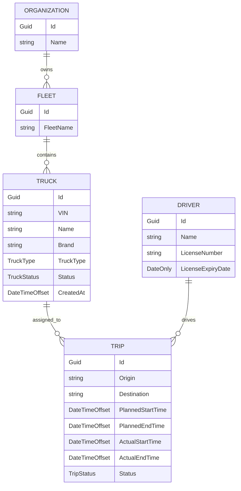

# TruckFleet ERD

This first ERD describes the Week 1 domain model. It is intentionally small and focuses on the core business concepts before APIs, persistence, telemetry, and authentication are added.

## Notes

- This diagram shows domain relationships, not final database tables.
